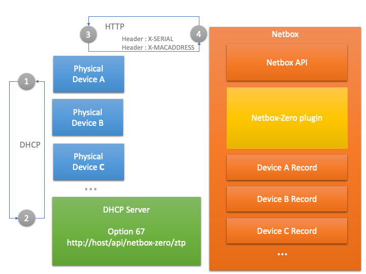

# Plugin Architecture

Netbox zero follows the pattern for Netbox extension. 
An overview of the base architecture is shown in *figure 1* below. 

 

Figure 1

The plugin works in conjunction with a DHCP server (e.g. dnsmasq)
and the zero touch provisioning of the native harware device platform.

The plugin exposes a very simple HTTP API at 

    http[s]://[netbox ip/fqdn]:[port]/api/plugins/netbox-zero/ztp/

This URL should be set as the bootfile-name DHCO option 67. During the 
DHCP request/response 1 >2 > 1 in the figure 1 above.  

This URL is then called via HTTP GET by the platform ZTP process.
Typically this GET request will include one or more HTTP headers
This allows determination the Netbox device object representing 
the physical device. A template or JSON response containing 
the initial device config is then returned to the 
device as shown in HTTP request/response 3 > 4 > 3.

This response is augmented with data from the Netbox device 
object and allows the initial configuration of the physical 
device. Note additional device configuration with is not 
available in the core model can be added via the config-context
see [device configuration](device_configuration.md).

Extending the capability of the plugin for a specific device 
platform can be found [here](extension.md) and for details of the 
initial device ZTP GET request and available HTTP headers consult
the vendor documentation 

