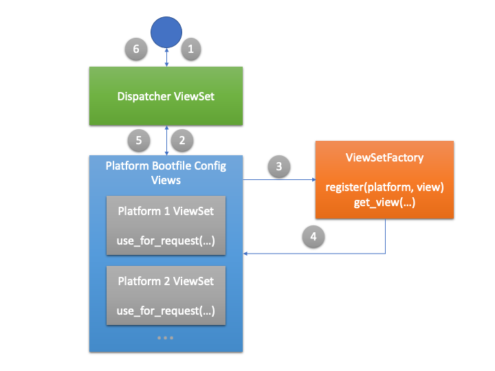

# Extending the Plugin

The plugin uses a slightly adapted version of the netbox/django 
API and rest framework. Instead of a CRUD based entity model the
plugin uses a static request to retrieve the boot request. The 
request is accessible at 

    http[s]://[netbox ip/fqdn]:[port]/api/plugins/netbox-zero/ztp/

and uses the request headers and parameters to detrmine the platform 
and dispatch the request to a view which can determine the device and 
generate the boot config for the device. This is shown schematically in
in *figure1* below.

Figure 1

1. Request is received from device  
2. Request is handled by a dispatcher view which uses the request 
   and crude factory implementation to;
3. Determine the concrete view that will handle the request
4. The view is processed, and the device is determined, and a template is used
   to generate the boot config from the device configuration in Netbox
5. The resulting config a returned to the dispatcher
6. Which in turn responds to the ZTP request from the device

To extend the plugin to add a new a platform the following steps should be performed:

1. A viewset should be created, by convention its should be added to `../netbox_zero/api/platform/platform_name.py`
2. Any templated used by the view set should be created in `../netbox_zero/templates/netbox_zero/api`
3. The new viewset should implement `use_for request(request)` which should return true if the 
   factory should use the viewset for the request (e.g. based on headers or request parameters)
   
4. The viewset should be registered in the constructor of the 
   factory class 

      class ViewFactory:

      def __init__(self):
         self._views = {}
         self.register("vEOS",EOSViewSet)

      def register(self, platform, view):
         self._views[platform] = view
   
      ...
   